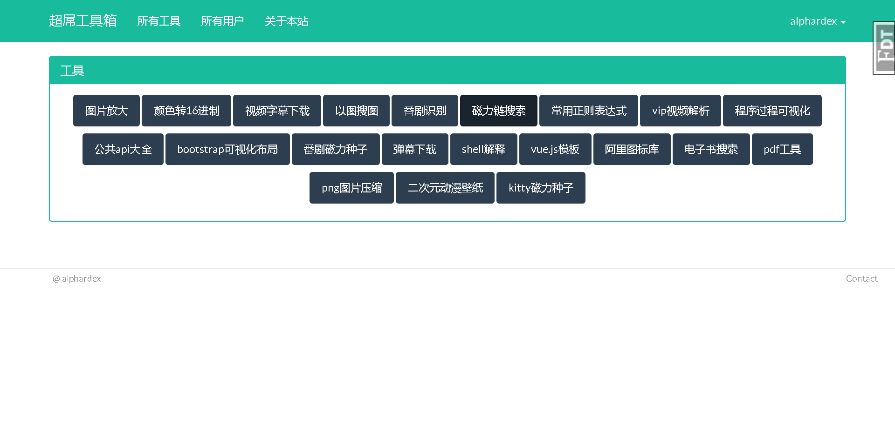

# 超屌工具箱

一个网站神器的集合之地。

demo地址：[猛戳这里](https://supertoolbox.herokuapp.com)

## 开发流程

把项目下载到本地

``` bash
git clone https://github.com/alphardex/supertool.git
```

创建虚拟环境并安装依赖

``` bash
python -m venv venv
source venv/Scripts/activate
pip install -r requirements.txt
```

迁移数据库

``` bash
flask db init
flask db migrate
flask db upgrade
```

运行app即可

``` bash
export FLASK_APP=supertool.py
flask run
```

## 预览

